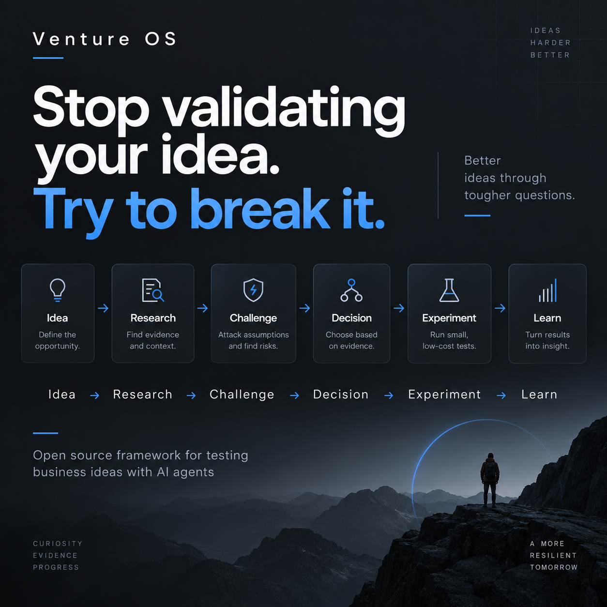

# Venture OS

<p align="center">
  
</p>

An open-source, evidence-first operating system for turning business ideas into tested decisions with AI agents.

**Venture OS v0.1 is Claude Code-first.** It helps founders and builders move from an idea to evidence, an auditable decision, and a real-world experiment without making “build the product” the default answer.

```text
Idea → Research → Challenge → Decision → Experiment → Learn
```

The public flow above is intentionally simple. Internally, decisions branch: `PROCEED` moves into positioning before experiment design, `TEST` targets the blocking assumption with the cheapest credible experiment, and `PARK` stops investment until an explicit revisit condition becomes true.

## Start here

Requirements:

- Claude Code
- Node.js 20+
- Git

```bash
git clone https://github.com/nacorga/venture-os.git
cd venture-os
npm install
npm run repo:check
npm run venture:new -- my-venture "A B2B SaaS that helps small teams detect costly workflow anomalies before they become incidents"
claude
```

Then run, one stage at a time:

```text
/venture-new ventures/my-venture
/venture-research ventures/my-venture
/venture-challenge ventures/my-venture
/venture-decide ventures/my-venture
```

Your current state lives in `ventures/my-venture/venture.yaml`; immutable decision records live under `ventures/my-venture/decisions/`.

For the complete first-run path, expected outputs, and gate-specific next steps, use **[`docs/QUICKSTART.md`](docs/QUICKSTART.md)**.

## Why this exists

AI can generate convincing business advice very easily. Venture OS makes that advice harder to fake by requiring:

- explicit assumptions;
- traceable evidence;
- disconfirming research;
- auditable decisions;
- cheap experiments before expensive builds;
- persistent state that survives chat sessions.

The system does not assign an overall “idea score.” It asks what is known, what is assumed, what could kill the thesis, and what the cheapest credible next test is.

## Decision gates

Every material decision uses one of three outcomes:

- **PROCEED** — current evidence justifies investing in the next stage;
- **TEST** — the opportunity remains plausible, but a critical assumption blocks further commitment;
- **PARK** — current evidence does not justify more investment now.

`PARK` is not permanent rejection. It must record what new evidence would justify reopening the venture. The thesis itself can change as evidence changes, but thesis reframing is not a fourth gate outcome.

## Continue the venture

After `/venture-decide`, follow the gate rather than a fixed pipeline:

```text
PROCEED → /venture-position → /venture-experiment
TEST    → /venture-experiment
PARK    → stop until a recorded revisit condition is met
```

After a real-world experiment:

```text
/venture-learn ventures/my-venture
/venture-decide ventures/my-venture
```

At any point:

```text
/venture-status ventures/my-venture
```

See [`docs/WORKFLOWS.md`](docs/WORKFLOWS.md) for the canonical command map.

## Case Library

The public Case Library contains portable business/problem inputs under `cases/<id>/case.yaml`.

Create and validate a case with:

```bash
npm run case:new -- invoice-reconciliation-saas \
  "Invoice reconciliation for small finance teams" \
  "A B2B SaaS that helps small finance teams detect mismatches between invoices, payments, and accounting records." \
  b2b-saas \
  --tag finance \
  --tag reconciliation

npm run case:validate -- invoice-reconciliation-saas
```

A contributed case is input only. Expected gates, evaluator hints, and scoring metadata stay separate.

See [`cases/README.md`](cases/README.md), [`docs/CASE_FORMAT.md`](docs/CASE_FORMAT.md), and [`CONTRIBUTING.md`](CONTRIBUTING.md).

## Benchmark workflow

Public benchmark inputs come from the Case Library. Maintainer-owned evaluator expectations remain separate under `evals/reference/`.

```text
/eval-new inventory-monitoring-saas claude-opus-5
```

The eval workflow preserves fresh-session boundaries through run, freeze, and score. Real or sensitive benchmarks belong outside this repository and should be executed against a pinned public commit.

See [`evals/README.md`](evals/README.md) and [`docs/PUBLICATION.md`](docs/PUBLICATION.md).

## Feedback and hosted interest

Venture OS v0.1 prioritizes **completed workflows** over attention metrics. The useful signals are whether someone creates a venture, reaches a decision, designs or executes an experiment, and changes a real next action.

There is no hidden usage telemetry required for v0.1. Feedback is explicit and user-submitted through GitHub Issues or Discussions. See [`docs/FEEDBACK.md`](docs/FEEDBACK.md).

If a hosted version would remove meaningful workflow pain for you, use the **Workflow feedback** issue form and select `Yes` or `Maybe` for hosted-version interest. No mailing-list signup is required.

## Contributing

The smallest useful contribution is often a new Case Library entry. CI validates repository structure, public `case.yaml` files, the venture onboarding scaffold, and the bridge into the eval harness.

Start with [`CONTRIBUTING.md`](CONTRIBUTING.md).

## Repository model

- `.claude/agents/` — specialized subagents with narrow mandates.
- `.claude/skills/` — reusable workflows and the main human-facing command surface.
- `framework/` — methodology, evidence rules, stages, gates, and schemas.
- `templates/` — canonical output structures.
- `ventures/` — local venture workspaces; do not commit sensitive venture data.
- `cases/` — public, portable Case Library inputs.
- `evals/reference/` — evaluator-only expectations for the scored public regression subset.
- `evals/runs/` — generated benchmark executions.
- `scripts/` — deterministic mechanics; business judgment remains with agents and humans.

## Design principles

1. Evidence before recommendation.
2. Falsification before commitment.
3. Separate fact, inference, assumption, and opinion.
4. Unknown is a valid state.
5. Prefer the cheapest experiment that can remove the most important uncertainty.
6. Never let a score replace reasoning.
7. Decisions must remain auditable.
8. New evidence can overturn old decisions.
9. Building is only one possible next action.
10. Human judgment owns irreversible decisions.
11. Repeated operational prompting belongs in skills.

## Current scope

Venture OS currently focuses on the path from idea to real-world experiment. Product implementation, deployment automation, CRM, billing, and analytics integrations are intentionally out of scope until real usage shows they are needed.

## What success looks like

The important question is not how many outputs the agents generate. It is whether Venture OS helps users:

- identify the right unknowns;
- resist confirmation bias;
- discover evidence they would otherwise miss;
- choose cheaper tests before expensive builds;
- keep decisions consistent across sessions;
- change conclusions when contradictory evidence appears;
- reach real-world experiments with less wasted work.

GitHub stars and forks are secondary signals. Completed decision and experiment loops are stronger ones.

## Release status

`v0.1.0` is the first public release. The public repository was initialized from a sanitized root history; private development history and real/sensitive benchmark material remain outside it.

The technical launch gate is complete. The current validation gate is external usage: at least 10 people who did not build Venture OS should attempt the Quickstart without live guidance. See [`docs/LAUNCH_CHECKLIST.md`](docs/LAUNCH_CHECKLIST.md).

## License

MIT. See [`LICENSE`](LICENSE).
